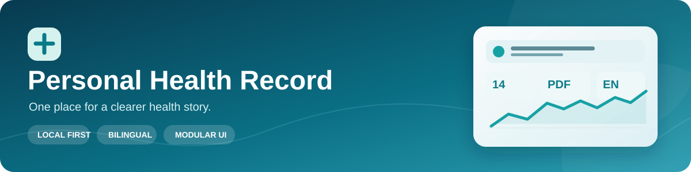
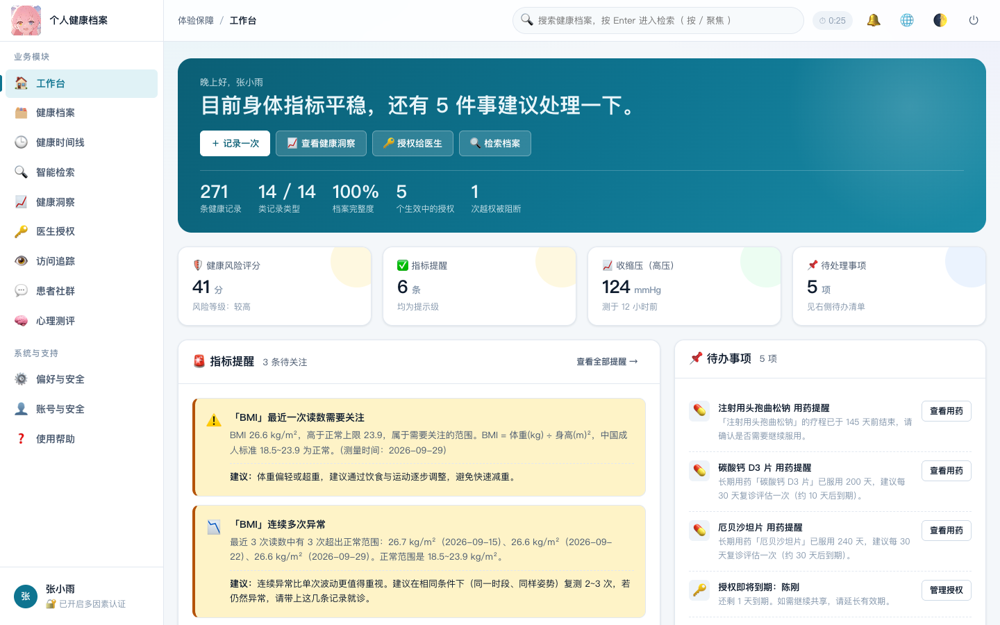
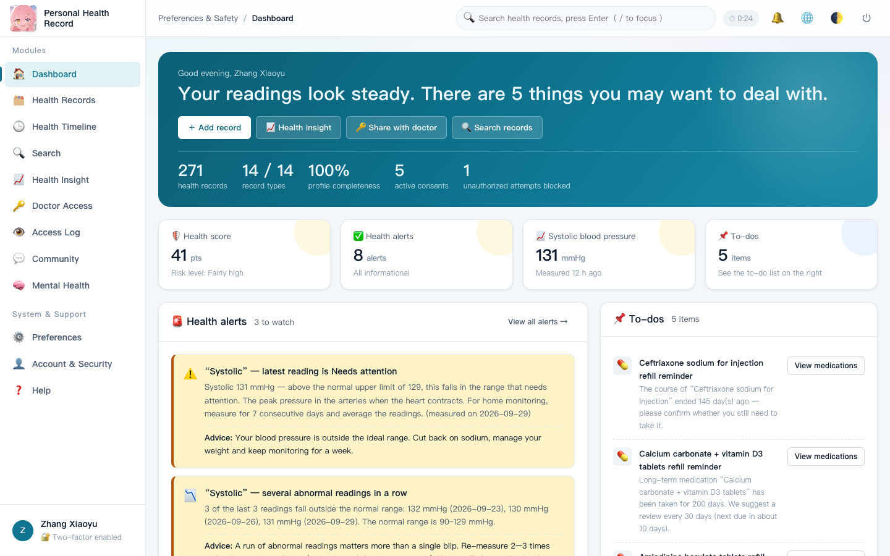
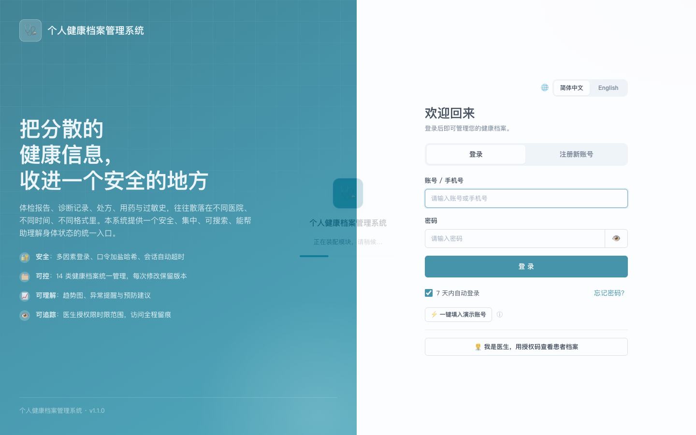
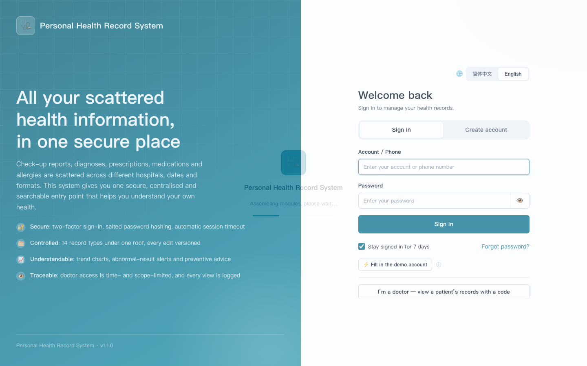
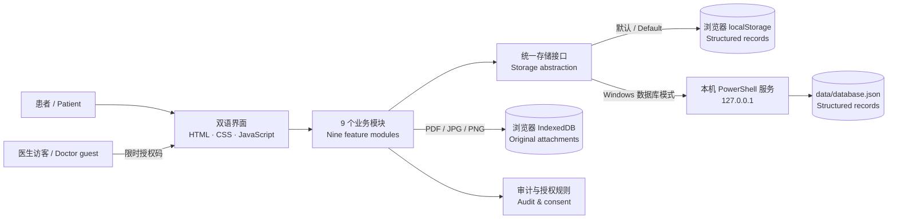

<div align="center">



# 个人健康档案管理系统 · Personal Health Record System

**把分散的健康信息，收进一个更清晰、可控的地方。**<br>
**Bring scattered health information into one clearer, more controllable place.**

[中文介绍](#中文介绍) · [English](#english) · [功能截图](#功能截图--screenshots) · [设计文档](#文档--documentation)


</div>

> [!IMPORTANT]
> 这是教学用的本地演示原型，**不是医疗器械，也不适合保存真实患者资料或直接部署到生产环境**。健康提示不能替代医生诊断。<br>
> This is a local educational prototype, **not a medical device or a production-ready patient record system**. Its health insights are not medical advice.

---

<a id="功能截图--screenshots"></a>
## 功能截图 · Screenshots

以下截图由全新浏览器会话中的**内置虚构演示数据**生成。点击图片可查看大图。<br>
The images below use **built-in fictional demo data** in a fresh browser session. Click to enlarge.

| 中文工作台 · Chinese dashboard | English dashboard |
| :---: | :---: |
| [](docs/screenshots/dashboard-zh.png) | [](docs/screenshots/dashboard-en.png) |

<details>
<summary>查看中英文登录界面 / View Chinese and English sign-in screens</summary>

| 中文登录 · Chinese sign-in | English sign-in |
| :---: | :---: |
| [](docs/screenshots/login-zh.png) | [](docs/screenshots/login-en.png) |

</details>

---

<a id="中文介绍"></a>
## 🇨🇳 中文介绍

### 项目简介

个人健康档案管理系统（PHR）是一套可在本机运行的课程项目原型。它将体征、检查、诊断、用药、过敏及医院报告等信息整合为可检索、可追溯的个人健康时间线，并提供规则驱动的趋势与异常提示、限时限范围的医生授权，以及中英文界面。

项目采用原生 HTML、CSS、JavaScript 构建；无需安装前端依赖或执行构建命令。默认模式将结构化数据保存在浏览器；Windows 上还可选择本地 PowerShell 数据库模式，把结构化数据写入 `data/database.json`。**PDF/JPG/PNG 原始附件单独保存在当前浏览器的 IndexedDB 中，不包含在该 JSON 文件或普通数据备份内。**

### 功能地图

| 模块 | 主要能力 |
| --- | --- |
| 🔐 账号安全 | 注册、登录、演示型短信/人脸二次验证、登录保持与失败锁定 |
| 🗂️ 健康档案 | 14 类记录、结构化录入、时间线、版本历史、医院报告附件上传/预览/下载 |
| 🔎 智能检索 | 倒排索引、模糊匹配、同义词与多条件筛选 |
| 📈 健康洞察 | 体征趋势、阈值与异常提醒、规则驱动的风险提示 |
| 🔑 医生授权 | 患者发放授权码，按档案范围和有效期开放医生访客视图 |
| 👁️ 访问追踪 | 访问日志、越权阻断记录与异常行为提示 |
| 💬 患者社群 | 匿名讨论、内容审核与举报 |
| ⚙️ 体验保障 | 工作台、主题与无障碍设置、数据备份/恢复和自检 |
| 🧠 心理测评 | 量表自评、分级报告与危机提示；为课程需求之外的扩展模块 |

### 系统结构与数据去向



> [!NOTE]
> 默认模式与数据库模式的数据位置不同，切换模式后看不到另一模式中的结构化记录并不意味着数据丢失。附件始终与**浏览器及站点来源**绑定；更换浏览器、清理站点数据或切换 `file://` / `http://` 来源后，原附件不会自动迁移。

### 运行项目

**macOS / Linux（浏览器本地模式）**

```bash
git clone https://github.com/tiempo0206/personal-health-record-system.git
cd personal-health-record-system
python3 -m http.server 4173 --bind 127.0.0.1
```

打开 `http://127.0.0.1:4173/`，或在地址后加 `?lang=en-US` 直接进入英文界面。普通静态服务器**不会**启用 `api/db`；应用会使用浏览器本地存储。也可直接双击 `index.html`，但请尽量固定一种打开方式，避免浏览器把不同来源视为不同数据空间。

**Windows**

| 启动文件 | 界面语言 | 结构化数据位置 |
| --- | --- | --- |
| `启动网站.bat` | 中文 | 浏览器本地存储 |
| `启动网站_enUS.bat` | English | 浏览器本地存储 |
| `启动数据库模式.bat` | 中文 | `data/database.json` |
| `启动数据库模式_enUS.bat` | English | `data/database.json` |

数据库模式使用项目自带的 `server/serve.ps1`，仅监听本机 `127.0.0.1`；运行需要 Windows PowerShell。首次使用会自动生成演示数据。页面顶栏以及登录/注册页均可切换语言；英文翻译仍采用中文兜底，少数内容可能保留中文。

### 演示账号与医院报告

在登录页点击“⚡ 一键填入演示账号”，再点击登录。演示环境可使用 `demo` / `Demo@2026`；短信验证环节可输入演示万能码 `000000`，或使用页面上直接显示的验证码。医生入口位于登录页下方，使用患者授权码进入受限视图；它不是独立的正式医生账号体系。更多测试情景见 [测试账号与授权码](测试账号与授权码.txt)。

上传医院报告：进入**健康档案 → 上传/导入**，选择 PDF、JPG 或 PNG（单文件上限 20 MB），保存后可在对应记录中预览与下载。PDF 由仓库内置的 PDF.js 渲染；CSV/JSON 是另一条**结构化记录导入**流程，不会把 PDF/图片自动识别为医学数据。附件原文件在浏览器 IndexedDB 中；导出 JSON 备份时请另外保管原附件。

### 隐私、限制与生产化边界

- 本仓库**不包含本机的 `data/database.json`、备份或运行时服务地址**；这些文件可能含账号与健康信息，已由 `.gitignore` 排除。
- 本项目的短信验证码与人脸验证是**教学演示**；人脸验证是前端模拟，不具备真实生物识别能力。万能验证码必须在生产环境删除。
- 口令哈希、客户端加密、授权和审计均用于展示设计思路，不能替代服务端鉴权、强口令派生、密钥管理、不可篡改日志及合规审计。
- 医院同步、风险提示与心理测评属于演示/规则逻辑；不连接真实医院，也不提供临床诊断。
- 附件使用浏览器本地 IndexedDB；它不会自动随 JSON 备份、Git 克隆或浏览器迁移而恢复。

---

<a id="english"></a>
## 🇬🇧 English

### Overview

Personal Health Record System (PHR) is a local-first course-project prototype for organising a person's health story. It brings vital signs, check-ups, diagnoses, medication, allergies, and hospital reports into searchable records and a chronological timeline. The interface includes rule-based insights, scoped and time-limited doctor access, audit trails, and a Chinese/English language switch.

The application is built with plain HTML, CSS, and JavaScript. There is no package installation or build step. Structured data normally lives in browser storage; an optional **Windows-only** PowerShell server writes it to `data/database.json`. Original PDF/JPG/PNG attachments live **separately in the browser's IndexedDB** and are **not** part of that JSON file or standard data exports.

### Features at a glance

| Area | What it does |
| --- | --- |
| 🔐 Identity | Registration, sign-in, demo SMS/face second factor, session persistence and lockout |
| 🗂️ Records | 14 record types, forms, timeline, version history, report attachment upload/preview/download |
| 🔎 Search | Inverted index, fuzzy matching, synonyms and filters |
| 📈 Insights | Vital trends, threshold-based alerts and rule-based risk hints |
| 🔑 Doctor access | Patient-issued access codes with a limited scope and expiry |
| 👁️ Audit | Access history, blocked unauthorised requests and anomaly hints |
| 💬 Community | Anonymous discussion with moderation and reporting |
| ⚙️ Experience | Dashboard, themes, accessibility preferences, backup/restore and integrity checks |
| 🧠 Mental health | Self-assessment scales, tiered reports and crisis guidance; an extension beyond the original eight-module brief |

### Quick start

On **macOS or Linux**, clone the repository and serve it locally:

```bash
git clone https://github.com/tiempo0206/personal-health-record-system.git
cd personal-health-record-system
python3 -m http.server 4173 --bind 127.0.0.1
```

Open `http://127.0.0.1:4173/?lang=en-US`. A regular static server does not provide `api/db`, so this uses browser storage. You can also open `index.html` directly, but keep using the same browser and origin if you want to see the same locally stored data.

On **Windows**, double-click `启动网站_enUS.bat` for English browser-storage mode or `启动数据库模式_enUS.bat` for English file-database mode. Their Chinese counterparts are `启动网站.bat` and `启动数据库模式.bat`. The file-database mode requires Windows PowerShell and stores structured data in `data/database.json`; see [the local data note](data/README.md).

Use **“Fill demo account”** on the sign-in page, then sign in. The sample account is `demo` / `Demo@2026`; the demo SMS code `000000` also works. These credentials and the simulated face factor are **for teaching/demo use only**. A doctor enters via a patient-issued access code, not via a production-grade clinician identity system. The complete demo scenarios are in [the test-accounts guide](测试账号与授权码.txt).

### Hospital-report workflow

1. Open **Health Records → Upload / Import**.
2. Select a PDF, JPG or PNG report (up to 20 MB) and save the record.
3. Open that record to preview or download its attachment. PDF pages are rendered by the vendored PDF.js library.

CSV/JSON import is a separate workflow for structured records; the app does **not** perform OCR or extract clinical facts from a PDF/image. Keep original attachment files separately when exporting or moving data: IndexedDB blobs are not bundled into JSON backups.

### Architecture and responsible use

The diagram above shows the main data paths: feature modules use a storage abstraction for structured records, while report files go to browser IndexedDB. The optional PowerShell service is local-only (`127.0.0.1`). Switching between browser and file-database modes changes where structured records live; switching browser or site origin also changes which attachments are visible.

This is **not a production medical system**. Demo SMS codes are visible in the UI, face verification is simulated, client-side password hashing/encryption is not a substitute for server-side security, and the insights are rule-based educational examples. There is no real hospital integration or clinical validation. Do not enter real patient information; do not treat any alert or score as a diagnosis. The local database, its backups and runtime URL are deliberately excluded from Git.

---

<a id="文档--documentation"></a>
## 文档 · Documentation

| 文件 / File | 内容 / Purpose |
| --- | --- |
| [模块总览](模块总览.md) | 模块、文件与页面路由 / Module, file and route map |
| [UML 图](UML图.md) | 用例、架构、类、ER、时序等设计图 / Design diagrams |
| [开发者说明书](开发者说明书.md) | 数据模型、接口约定、开发任务与生产化清单 / Developer reference |
| [客户使用说明书](客户使用说明书.md) | 功能操作与 FAQ / User guide and FAQ |
| [核心层](core/README.md) · [界面层](ui/README.md) | 模块内部设计 / Internal design notes |
| [`modules/`](modules/) | 每个业务模块的 README / A README for each feature module |
| [PDF.js license](vendor/pdfjs/LICENSE) | Bundled PDF.js third-party license |

```text
personal-health-record-system/
├── index.html, index_enUS.html    # Browser entry points
├── core/                          # Data dictionaries, i18n, storage and security
├── modules/                       # Nine feature modules
├── ui/                            # Shell, components, styles and assets
├── server/                        # Optional Windows local database server
├── data/                          # Runtime data (private files ignored by Git)
├── vendor/pdfjs/                  # Bundled PDF viewer
└── docs/screenshots/              # Screenshots made with fictional demo data
```

<div align="center"><sub>Built as a course project · 课程项目演示原型</sub></div>
