# 个人健康档案管理系统 —— UML 设计图

> 本文档使用 **Mermaid** 语法描述系统设计。在 VS Code（安装 Markdown Preview Mermaid 插件）、
> Typora、Obsidian 或 GitHub 上打开本文件即可看到渲染后的图形；
> 若使用不支持的编辑器，也可以直接阅读源码 —— Mermaid 是纯文本，语义自明。
>
> 全部图形与源码实现保持一致，如有改动请同步更新本文件与 `模块总览.md`。

---

## 目录

1. [用例图（Use Case Diagram）](#一用例图)
2. [系统分层架构图（Component Diagram）](#二系统分层架构图)
3. [模块依赖图（Package Diagram）](#三模块依赖图)
4. [核心类图（Class Diagram）](#四核心类图)
5. [实体关系图（ER Diagram）](#五实体关系图)
6. [时序图 · 多因素登录](#六时序图--多因素登录)
7. [时序图 · 医生授权访问档案](#七时序图--医生授权访问档案)
8. [时序图 · 录入记录与异常提醒](#八时序图--录入记录与异常提醒)
9. [状态图 · 医生授权生命周期](#九状态图--医生授权生命周期)
10. [状态图 · 账号与会话](#十状态图--账号与会话)
11. [活动图 · 健康档案生命周期](#十一活动图--健康档案生命周期)
12. [活动图 · 异常检测闭环](#十二活动图--异常检测闭环)
13. [部署图（Deployment Diagram）](#十三部署图)

---

## 一、用例图

### 1.1 总体用例

```mermaid
graph TB
    subgraph actors["参与者"]
        U(["👤 患者<br/>（档案所有者）"])
        D(["👨‍⚕️ 医生<br/>（持授权码访问）"])
        S(["🤖 系统<br/>（自动任务）"])
    end

    subgraph system["个人健康档案管理系统"]
        direction TB

        subgraph m1["模块1 账号安全"]
            UC11["注册账号"]
            UC12["密码登录"]
            UC13["多因素认证<br/>（短信 / 人脸）"]
            UC14["管理会话与密码"]
        end

        subgraph m2["模块2 档案中心"]
            UC21["录入健康记录<br/>（14 种类型）"]
            UC22["同步医院数据"]
            UC25["上传医院报告<br/>（CSV / JSON）"]
            UC23["管理个人基本信息"]
            UC24["查看 / 回滚版本历史"]
        end

        subgraph m3["模块3 智能搜索"]
            UC31["关键词 / 模糊检索"]
            UC32["按时间·类型·疾病分类筛选"]
        end

        subgraph m4["模块4 健康洞察"]
            UC41["查看指标趋势图"]
            UC42["接收异常提醒"]
            UC43["查看风险评分与预防建议"]
        end

        subgraph m5["模块5 医生授权"]
            UC51["创建授权<br/>（范围 + 有效期）"]
            UC52["延长 / 撤销授权"]
            UC53["凭授权码查看档案"]
        end

        subgraph m6["模块6 访问追踪"]
            UC61["查看审计日志"]
            UC62["接收异常访问告警"]
        end

        subgraph m7["模块7 患者社群"]
            UC71["匿名发帖 / 回复"]
            UC72["举报违规内容"]
        end

        subgraph m8["模块8 体验保障"]
            UC81["调整主题与无障碍设置"]
            UC82["导出 / 导入备份"]
            UC83["数据完整性自检"]
            UC84["查阅使用帮助"]
        end
    end

    U --> UC11
    U --> UC12 --> UC13
    U --> UC14
    U --> UC21
    U --> UC22
    U --> UC25
    U --> UC23
    U --> UC24
    U --> UC31
    U --> UC32
    U --> UC41
    U --> UC43
    U --> UC51
    U --> UC52
    U --> UC61
    U --> UC71
    U --> UC72
    U --> UC81
    U --> UC82
    U --> UC83
    U --> UC84

    D --> UC53

    S --> UC42
    S --> UC62
    S -.->|授权到期| UC52

    UC13 -.->|«include»| UC12
    UC51 -.->|«include»| UC52
    UC41 -.->|«extend»| UC42
    UC53 -.->|«include»| UC61
```

### 1.2 医生的受限用例（细化）

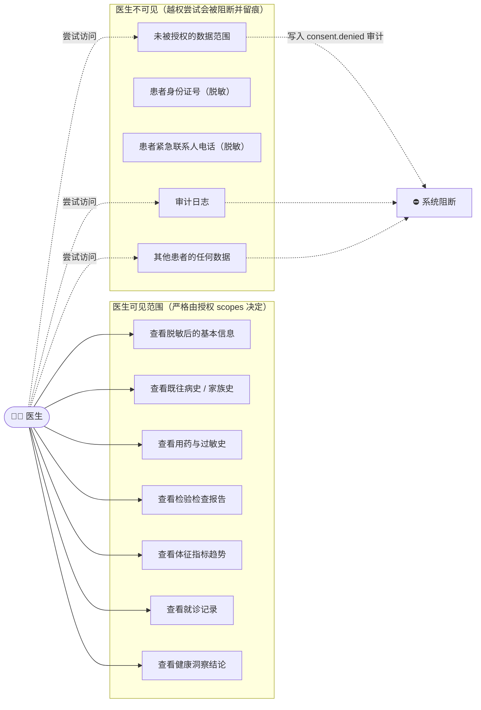

---

## 二、系统分层架构图

对应需求原文的"表现层 / 业务服务层 / 数据与集成层 / 安全治理层"四层设计。

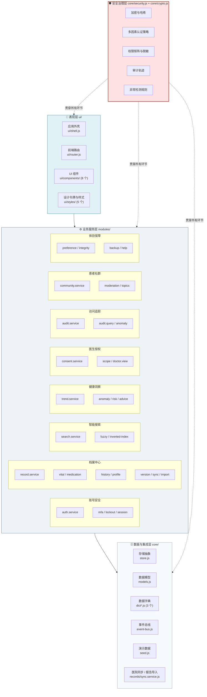

---

## 三、模块依赖图

依赖方向**严格单向**，不允许出现循环依赖。箭头表示"调用/读取"。

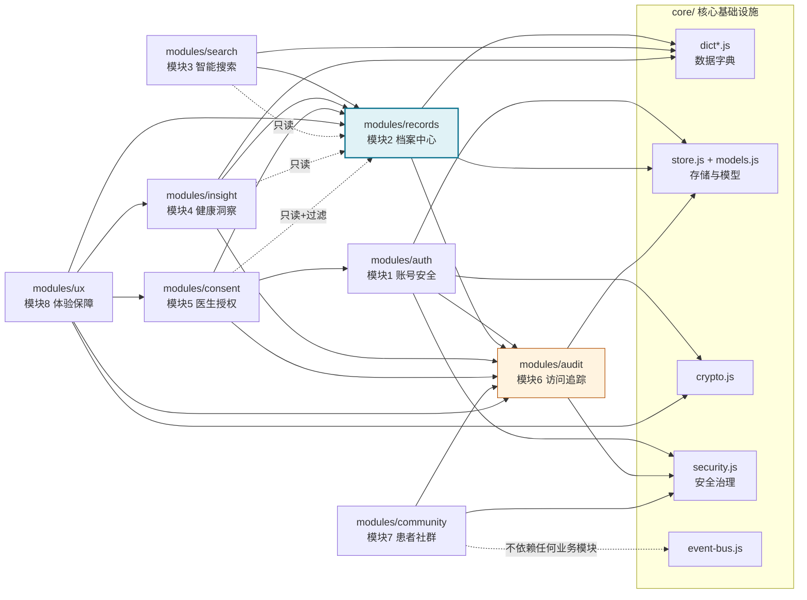

**关键设计**：
- `modules/audit` 被所有模块依赖，但自己**不依赖任何业务模块** —— 所以它最先加载。
- `modules/records` 是数据主体，被 search / insight / consent / ux 读取，但**不反向依赖**它们。
- 模块之间通过 `PHR.bus` 事件与 `PHR.db` 数据解耦，不直接引用对方的内部函数。

---

## 四、核心类图

### 4.1 领域实体

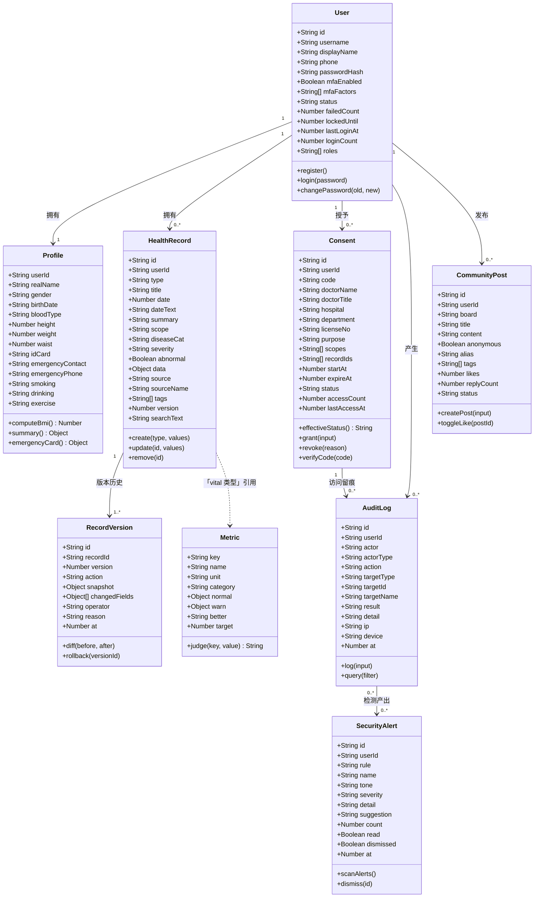

### 4.2 服务层类图

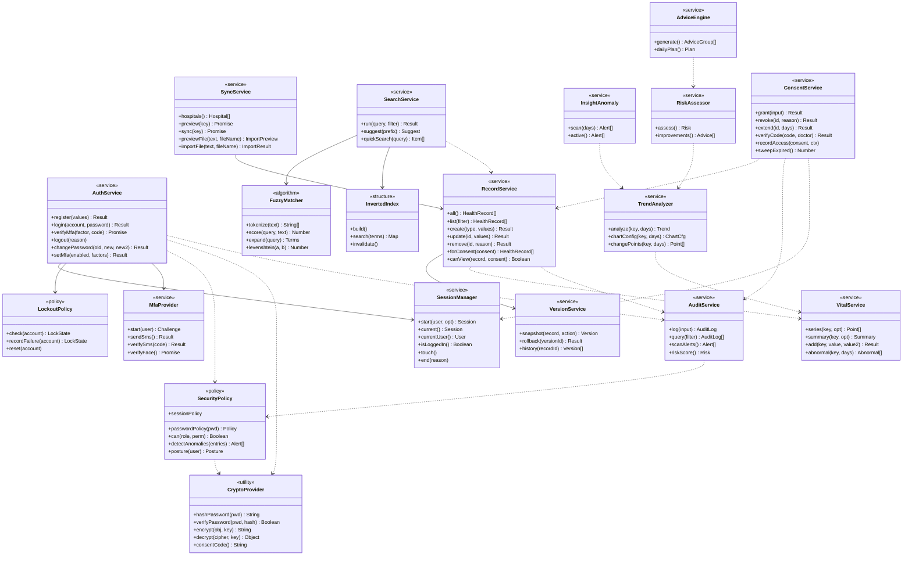

---

## 五、实体关系图

10 张数据表的完整关系（对应 `core/models.js` 的 `PHR.db.schema`）。

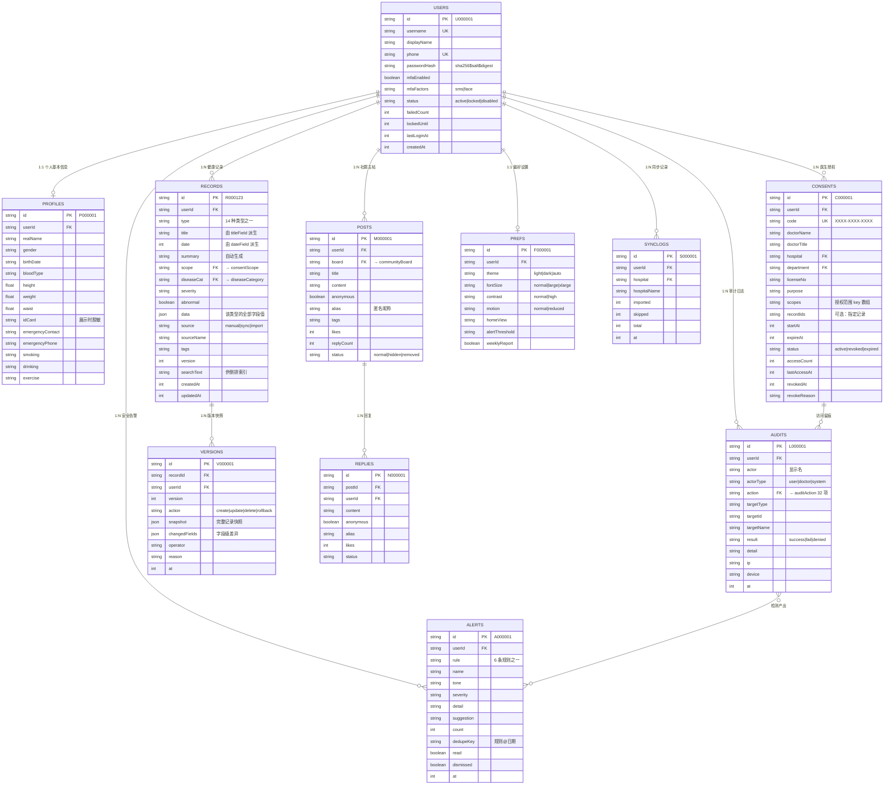

---

## 六、时序图 · 多因素登录

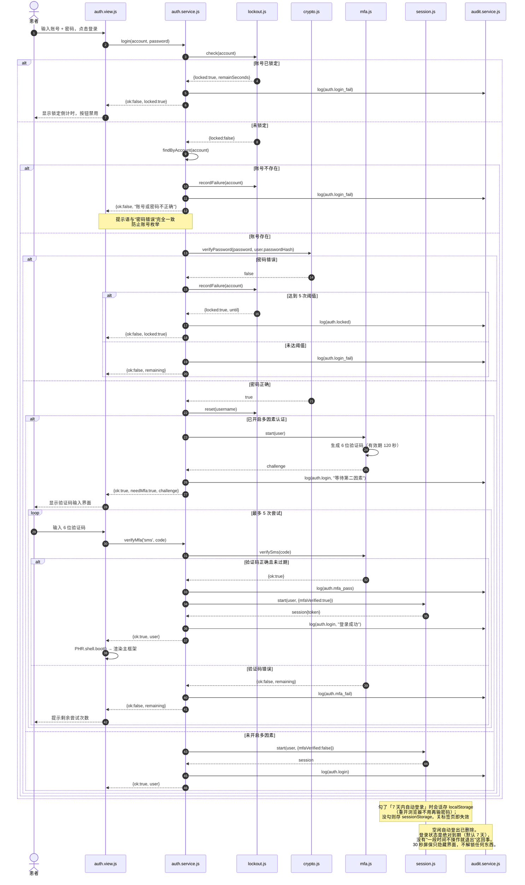

---

## 七、时序图 · 医生授权访问档案

这张图是本系统最核心的业务流程 —— 需求中"可信共享"的完整实现。

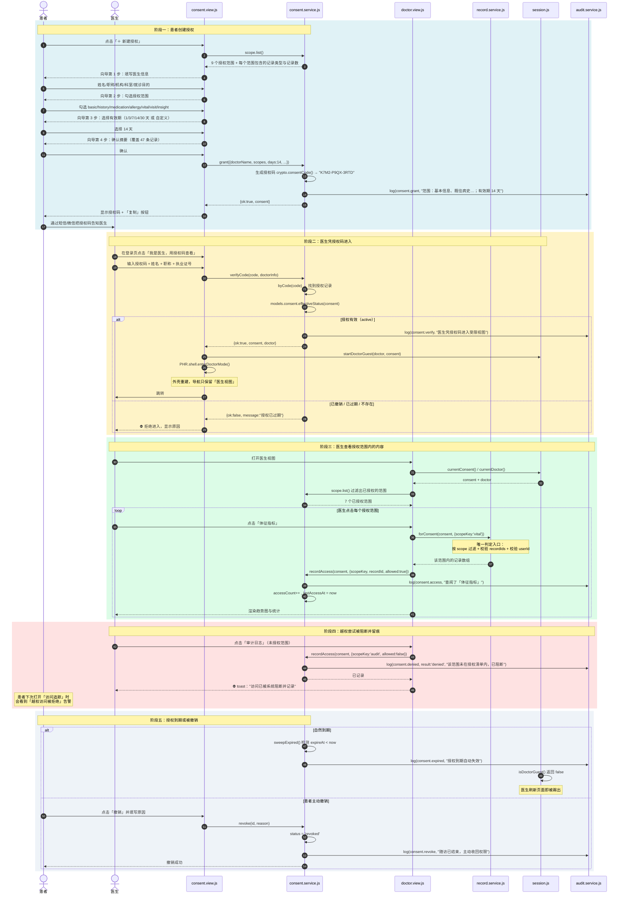

---

## 八、时序图 · 录入记录与异常提醒

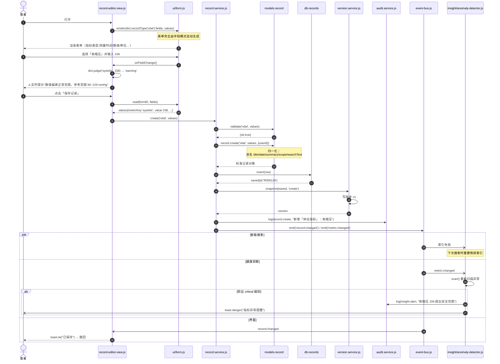

---

## 九、状态图 · 医生授权生命周期

```mermaid
stateDiagram-v2
    [*] --> 未创建

    未创建 --> 待生效 : grant()<br/>startAt > now
    未创建 --> 生效中 : grant()<br/>startAt ≤ now

    待生效 --> 生效中 : 到达 startAt<br/>（effectiveStatus 运行时判定）

    生效中 --> 已过期 : 到达 expireAt<br/>sweepExpired() 写 consent.expired 日志
    生效中 --> 已撤销 : revoke(reason)<br/>写 consent.revoke 日志

    已过期 --> 生效中 : extend(id, days)<br/>仅当状态未被 revoke
    已撤销 --> [*] : 不可恢复<br/>需重新创建授权

    已过期 --> [*]

    生效中 --> 生效中 : 医生每次访问<br/>accessCount++ / lastAccessAt 更新<br/>写 consent.access 日志
    生效中 --> 生效中 : 医生越权尝试<br/>写 consent.denied 日志（状态不变）

    note right of 生效中
        医生可凭授权码进入
        仅能查看 scopes 覆盖的范围
        每一次访问都会留痕
    end note

    note right of 已过期
        医生刷新页面即被踢出
        session.isDoctorGuest() 返回 false
        历史访问记录仍然保留
    end note
```

---

## 十、状态图 · 账号与会话

### 10.1 账号锁定状态

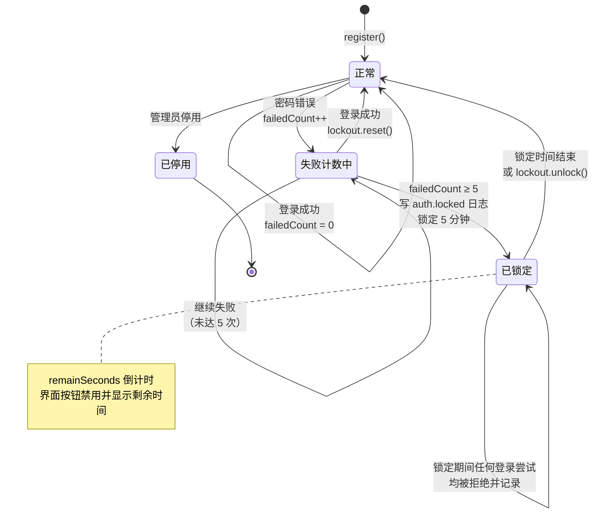

### 10.2 会话状态

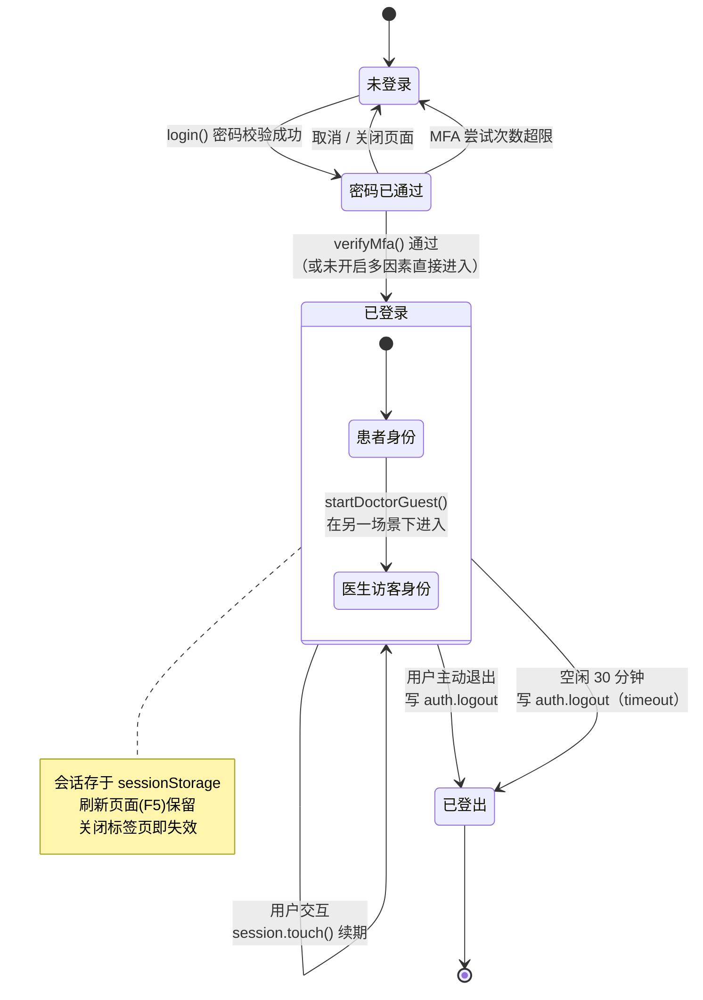

---

## 十一、活动图 · 健康档案生命周期

对应需求原文："第一条是健康档案生命周期：用户输入、上传结构化报告或医院同步数据后，
系统自动分类，随后用于搜索、查看趋势和生成提醒，同时所有修改都保留版本记录。"

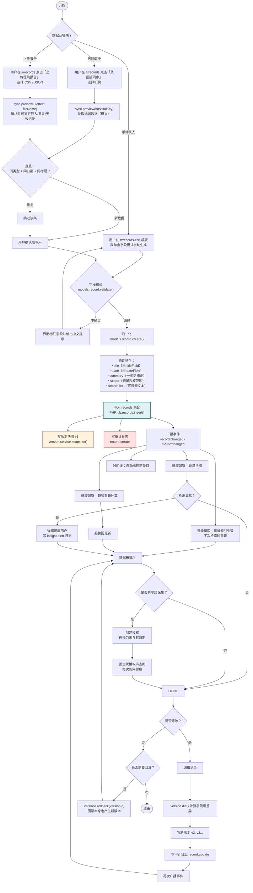

---

## 十二、活动图 · 异常检测闭环

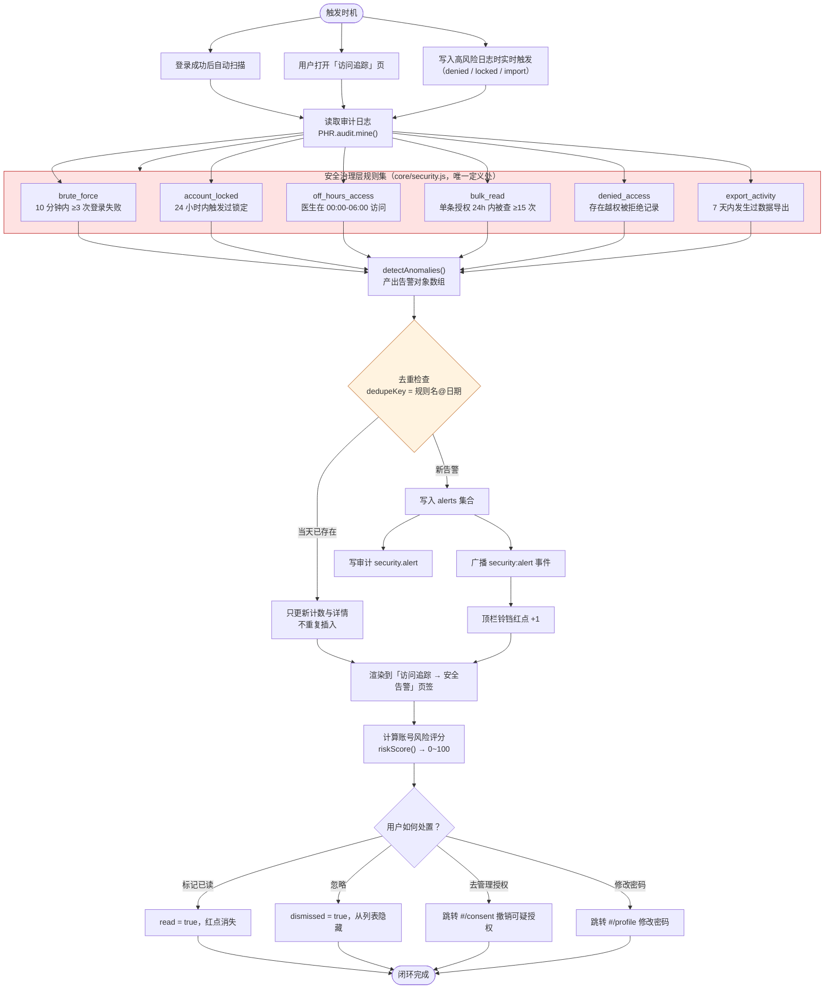

---

## 十三、部署图

本项目是**纯前端零依赖**应用，部署形态非常简单。

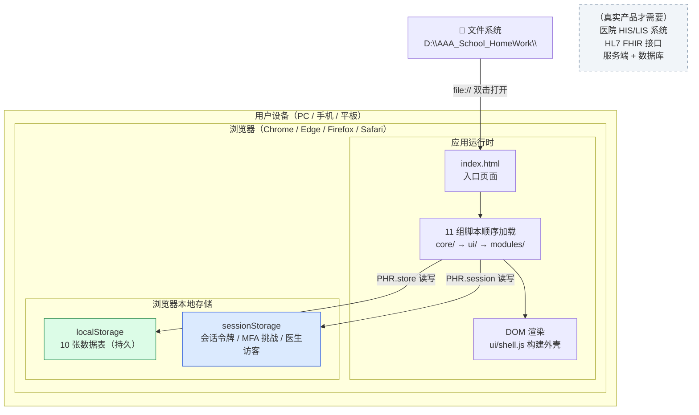

### 13.1 本演示环境 vs 真实生产环境

| 维度 | 本演示（当前实现） | 真实生产环境应有的形态 |
| --- | --- | --- |
| 运行位置 | 浏览器本地，`file://` 协议 | HTTPS 网站，前后端分离 |
| 数据存储 | `localStorage`（单机） | 服务端数据库（PostgreSQL / MongoDB）+ 对象存储 |
| 认证 | 客户端哈希校验 | 服务端校验，JWT / Session + OAuth2 |
| 口令哈希 | 纯 JS SHA-256 + 盐 | bcrypt / scrypt / Argon2 |
| 数据加密 | 导出文件 XOR 加密（演示级） | 传输 TLS 1.3 + 存储 AES-256-GCM，密钥由 KMS 托管 |
| 审计日志 | 本地数组，用户可改 | 只追加(append-only)存储 + 哈希链/签名，防篡改 |
| 医院同步 / 报告导入 | 内置模拟数据源 + CSV/JSON 结构化导入 | HL7 FHIR 接口 + 机构间数据共享协议；PDF/图片需 OCR 或检验结构化解析 |
| 人脸识别 | 随机数模拟 | 活体检测 + 服务端特征比对，模板加密存储 |
| 部署 | 复制文件夹即可 | 容器化 + CDN + 数据库主从 + 异地备份 |

---

## 附：图形与源码对应表

| 图形 | 对应源码位置 |
| --- | --- |
| 用例图 | 各模块 `README.md` 的"这个文件夹实现了什么"章节 |
| 分层架构图 | `core/README.md`、`ui/README.md`、各模块 README |
| 模块依赖图 | `index.html` 的 11 组脚本加载顺序注释 |
| 类图 | `core/models.js`（实体）、各 `*.service.js`（服务）、`core/security.js`（策略） |
| ER 图 | `core/models.js` 的 `PHR.db.schema`（10 张表定义） |
| 登录时序图 | `modules/auth/auth.service.js` + `mfa.js` + `session.js` + `lockout.js` |
| 授权时序图 | `modules/consent/consent.service.js` + `modules/records/record.service.js` 的 `forConsent/canView` |
| 录入时序图 | `modules/records/record-editor.view.js` + `record.service.js` + `version.service.js` |
| 授权状态图 | `PHR.models.consent.effectiveStatus()` + `consent.service.sweepExpired()` |
| 账号状态图 | `modules/auth/lockout.js` + `session.js` |
| 档案生命周期活动图 | `modules/records/` 全部服务 + `core/models.js` 的派生逻辑 |
| 异常检测活动图 | `core/security.js` 的 `anomalyRules` + `modules/audit/security-anomaly.js` |
| 部署图 | `index.html` 的加载方式说明 + `core/README.md` 的"加密能力的真实边界" |
